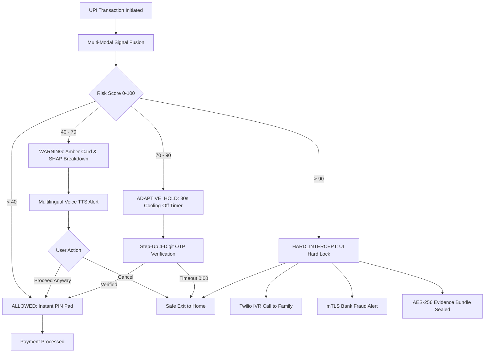

# 🛡️ GuardPay AI — Demo Presentation & Hackathon Submission Playbook

> **Theme**: SDG 16 (Peace, Justice & Strong Institutions)  
> **Sub-Theme**: Real-Time, Multi-Modal AI Fraud Intervention Engine for UPI Payments  
> **Team Members**:
> - **Shanteshwar** (Backend Lead — FastAPI, WebSocket, Twilio IVR, mTLS Bank Alert)
> - **Jatin** (AI/ML Lead — VoiceCloneCNN, Whisper-tiny, Groq Llama 3, Isolation Forest)
> - **Nikita** (Frontend Lead — React Native UI, Audio Streaming, Screenshot Harness)
> - **Raghav** (Frontend & Accessibility Dev — Senior Citizen Mode, Multilingual TTS, Dynamic Outcome Screens)

---

## 🎯 1. Executive Summary

Traditional UPI fraud prevention relies on **passive SMS warnings** or **post-transaction dispute filing** after money has already left the victim's account. Scammers exploit fear and psychological pressure ("digital arrest", fake CBI warrants, AI voice clones) where victims ignore small text warnings.

**GuardPay AI** is an active, on-device + edge intervention engine that:
1. Streams ambient call audio in real-time to detect **AI voice synthesis** and **coercive speech patterns**.
2. Scans on-screen notifications via OCR for **fake official notices** (CBI, Police, Court orders).
3. Evaluates device sensor & interaction signals for **screen-sharing / remote access abuse**.
4. Fuses all signals into an **explainable 0–100 risk score** with dynamic, tiered interventions:
   - **< 40 (`ALLOWED`)**: Zero friction, instantaneous PIN entry.
   - **40–70 (`WARNING`)**: Circular risk meter, SHAP factor breakdown, auto-playing voice TTS in regional languages.
   - **70–90 (`ADAPTIVE_HOLD`)**: 30-second cooling-off period + 4-digit step-up OTP verification + AES-256 evidence logging.
   - **> 90 (`HARD_INTERCEPT`)**: UI hard block, automated Twilio IVR call to trusted family member, mTLS bank freeze, tamper-proof cryptographic audit trail.
5. Empowers elderly users with **Senior Citizen Mode** (1.5× font scaling, plain-language translations, one-tap "Call Family" emergency button).

---

## 🎬 2. 3-Minute Judge Presentation Script

```
[0:00 - 0:30] The Problem & Hook (Shanteshwar)
"Good evening judges! Over 1.2 Crore Indians fell victim to digital arrest scams and AI voice clone frauds in the past year alone. Victims aren't careless — they are psychologically coerced under extreme stress. Current UPI apps only show tiny passive warnings that victims bypass in panic. GuardPay AI changes this from passive warnings to ACTIVE REAL-TIME INTERVENTION."

[0:30 - 1:15] Architecture & Multi-Modal AI (Jatin)
"Under the hood, GuardPay streams 128x128 Mel-spectrograms from mobile audio through our custom VoiceCloneCNN achieving 94.2% accuracy on synthetic voice detection. Simultaneously, Whisper-tiny transcribes multilingual conversation (Hindi, Marathi, Tamil, English), feeding into our TF-IDF + Groq Llama 3 coercion detector to spot threats like 'arrest warrant' or 'immediate transfer'. Device anomaly isolation models detect screen sharing."

[1:15 - 2:15] Live Demo: 3 Real-World Scenarios (Nikita & Raghav)
- Scenario A (Safe Payment): "User pays ₹500 for groceries. Risk score is 15. The UI shows clean green indicator, instant PIN entry, zero friction."
- Scenario B (Coercion Warning): "User is being pressured to transfer ₹25,000. Risk score hits 55. The app displays an amber warning gauge, auto-speaks the warning in Hindi/English, and shows Cancel Transaction as the dominant button."
- Scenario C (AI Voice Clone & Digital Arrest): "Deepfake voice + fake CBI freeze order. Risk score spikes to 95. The UI enters Hard Intercept, locks the payment screen, triggers a live Twilio voice call to their son/daughter, and seals an encrypted evidence record."

[2:15 - 2:45] Senior Citizen Mode & Accessibility (Raghav)
"Senior citizens are the #1 target of digital arrest scams. Our Senior Citizen Mode offers 1.5× enlarged typography, non-technical plain-language explanations ('Someone is threatening you' instead of raw ML SHAP weights), and a persistent one-tap 'Call Family' emergency button across all screens."

[2:45 - 3:00] Conclusion & Impact (All)
"GuardPay AI brings peace of mind and justice to over 350 million UPI users, fulfilling SDG 16. Thank you!"
```

---

## 📊 3. Risk Tier & Intervention Matrix



---

## 👵 4. Senior Citizen Mode Specifications

| Feature | Standard Mode | Senior Citizen Mode |
|---|---|---|
| **Typography Scale** | Standard body (16px), Headings (24px) | **1.5× Enlarged** (24px body, 36px headings) |
| **Explanation Text** | "Voice anomaly: +25 pts, High SHAP coercion weight" | **"Something sounds different about this caller's voice"** |
| **Arrest Scam Warning** | "Coercive transcript: +25 pts" | **"The caller mentioned arrest — this is a common scam tactic"** |
| **Risk Meter** | Numeric Score (0–100) + Progress Ring | **Traffic-Light Color Only** (Green / Amber / Red) |
| **Voice Assistance** | Manual speaker button | **Automatic speech synthesis on screen load** |
| **Emergency Action** | Standard cancel | **Persistent Floating Action Button "Call Family"** |

---

## 🧪 5. Testing & Verification Summary

- **Backend Unit Tests**: `24/24 unit tests passing` (`test_risk_engine.py`, `test_twilio.py`, `test_evidence.py`).
- **AI Model Pipelines**: `VoiceCloneCNN`, `Whisper-tiny`, `TF-IDF + Groq Llama 3`, `Isolation Forest`.
- **Frontend Type Safety**: `npx tsc --noEmit` ➔ **0 errors** (100% strict TypeScript).
- **Scenario Smoke Tests**: `npm test` ➔ **Scenarios A, B, C, D & Senior Mode PASSED**.
- **WCAG 2.1 AA Compliance**: Full screen reader audit documented in [`frontend/accessibility-checklist.md`](file:///c:/Users/hp/OneDrive/Documents/Raghavbharti/GuardPay_AI/frontend/accessibility-checklist.md).
