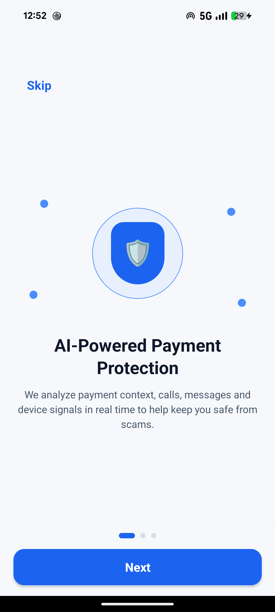
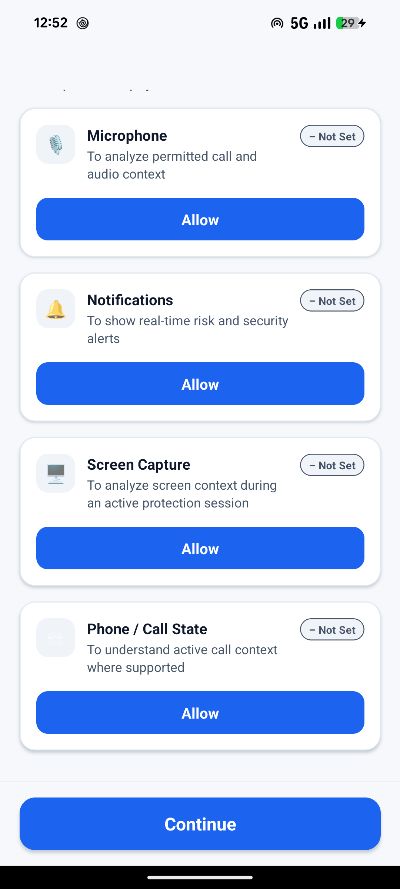
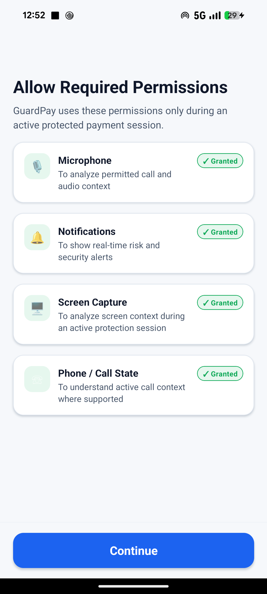
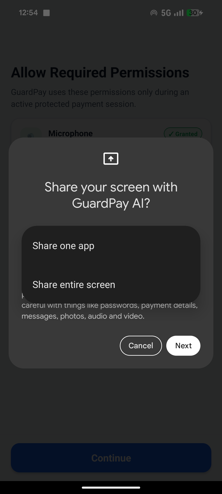
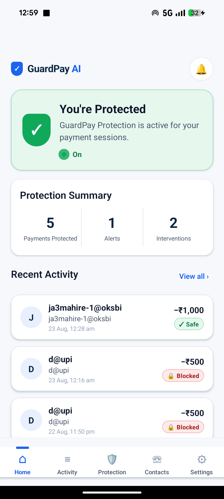
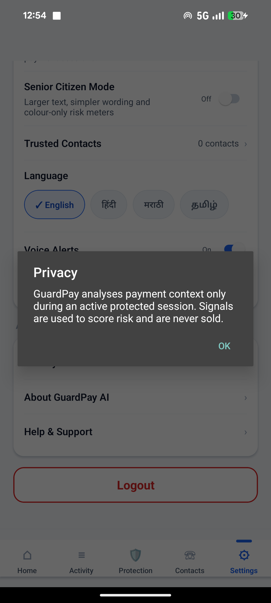
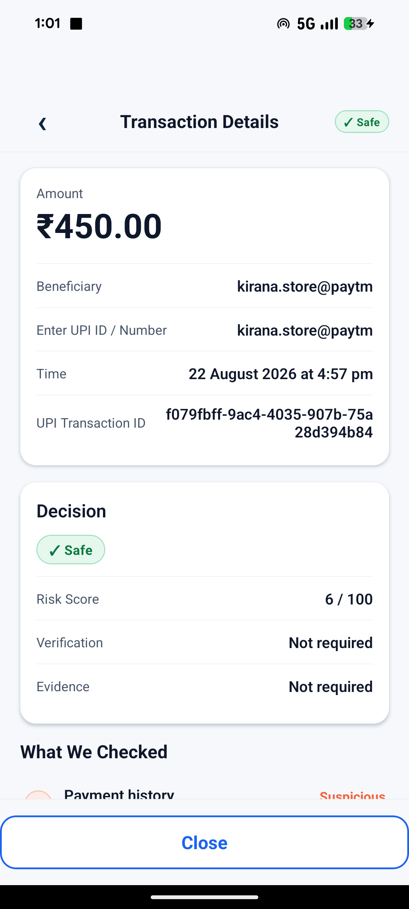
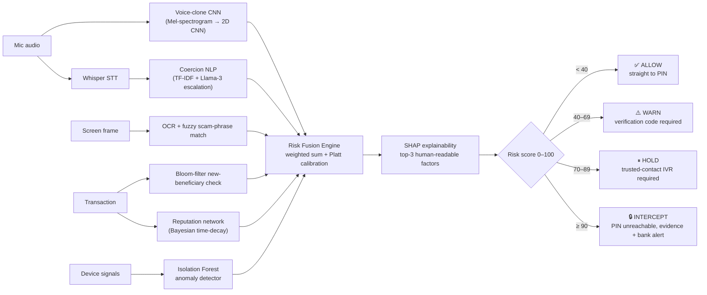

<h1 align="center">
  🛡️ GuardPay AI
</h1>

<p align="center">
  <strong>Real-time UPI payment protection that checks the context around a payment — before authorization, not after the money is gone.</strong>
</p>

<p align="center">
  <em>Smart. Secure. You're in Control.</em>
</p>

<p align="center">
  
  
  
  
  
</p>

---

## The problem

India's "digital arrest" scam pattern is simple and devastatingly effective: a fraudster impersonates police, CBI, or a bank official over a phone call, manufactures panic ("your account is linked to a crime," "you'll be arrested"), and pressures the victim into transferring money immediately — while staying on the call so the victim never gets a moment to think.

- **13,516** digital-fraud cases reported in a single year in India, **₹520 crore** lost (RBI)
- AI voice-cloning defeats human auditory recognition in an estimated **35%** of cases
- Existing UPI apps show a static text warning the victim ignores under duress
- A newly-added beneficiary is disproportionately involved in these scams — a signal most apps don't use at all

GuardPay AI sits inside the payment flow and fuses six independent signals — voice authenticity, conversation coercion, on-screen scam content, beneficiary reputation, new-beneficiary risk, and device-behaviour anomalies — into one explainable 0–100 risk score, then responds proportionately: **allow, warn, hold, or intercept.**

---

## 📱 Screenshots

The build below is the real installed app, running against the live backend on a physical Pixel 8a — not mockups.

<table>
<tr>
<td width="33%"><p align="center"><sub>Onboarding — plain language, no jargon</sub></p></td>
<td width="33%"><p align="center"><sub>Permissions — every row is a real OS permission</sub></p></td>
<td width="33%"><p align="center"><sub>Real grants, not simulated states</sub></p></td>
</tr>
<tr>
<td width="33%"><p align="center"><sub>The actual Android MediaProjection consent dialog — triggered by a native module, not faked</sub></p></td>
<td width="33%"><p align="center"><sub>Home — real transaction history and computed protection summary from the backend, not mock data</sub></p></td>
<td width="33%"><p align="center"><sub>Settings — every toggle persists, 4-language picker</sub></p></td>
</tr>
<tr>
<td colspan="3" align="center"><p align="center"><sub>Transaction detail — real risk score, decision, and "What We Checked" factor breakdown from the live risk-fusion engine</sub></p></td>
</tr>
</table>

> Every permission row, every dialog, every number on these screens is live — see [Honesty & what's real vs. simulated](#-honesty--whats-real-vs-simulated) below for the two capabilities Android genuinely has no API for.

---

## How it decides



The six factor weights (`W1..W6 = 0.25 / 0.20 / 0.15 / 0.20 / 0.10 / 0.10`) live in exactly one place — [`backend/services/risk_fusion.py`](backend/services/risk_fusion.py) — and the frontend never recomputes or hardcodes a threshold; every screen reads tier behaviour from [`config/riskTiers.ts`](frontend/GuardPayUI/src/config/riskTiers.ts).

**The authorization gate is enforced server-side, not just in the UI.** [`backend/services/payment_session.py`](backend/services/payment_session.py) implements an explicit state-machine transition table where `INTERCEPTED`/`FROZEN` can never reach `AUTHORIZED` — verified by directly attacking the API (see [Verified results](#-verified-results)).

---

## ✨ Features

| Area | What's implemented |
|---|---|
| **Voice deepfake detection** | 2D CNN (Conv→BN→ReLU→MaxPool ×2 → GAP → Sigmoid) trained on the **full real ASVspoof2019 LA corpus** (122k files), not synthetic fallback data |
| **Coercion detection** | 537-phrase lexicon across English/Hindi/Marathi/Tamil (proper Devanagari/Tamil script + romanised variants for Whisper output), TF-IDF fast path + Groq Llama-3 escalation |
| **Screen-content analysis** | OCR + Levenshtein fuzzy matching against scam phrases ("Arrest Warrant", "Account Freeze", …) |
| **Beneficiary risk** | Bloom-filter O(1) new-payee detection (10k seeded pairs) + Bayesian time-decay reputation network |
| **Device behaviour** | Isolation Forest anomaly detector over screen-share duration, app-switch locking, tap cadence, typing speed |
| **Explainability** | Real `shap.LinearExplainer` + Platt-scaled calibration, not a bare weighted sum |
| **Live pipeline** | WebSocket audio → CNN → Whisper → coercion engine → SSE score stream, updating in real time as a call progresses |
| **Payment state machine** | Explicit CREATED→EVALUATING→(ALLOWED\|WARNING\|HELD\|INTERCEPTED)→AUTHORIZED/CANCELLED/FROZEN gate; blocked tiers cannot reach the PIN pad under any call sequence |
| **Trusted-contact IVR** | Twilio Programmable Voice with a documented simulated fallback when no Twilio account is configured |
| **Evidence preservation** | AES-256-GCM encrypted bundles (transcript snippet, SHA-256 audio fingerprint, SHAP breakdown) for every Warning/Hold/Intercept |
| **Bank/PSP alert** | Retried POST to the bank's fraud-alert endpoint on Hold/Intercept |
| **Senior Citizen Mode** | 1.5× font scaling, simplified wording, colour-only risk meter (no raw numbers), one-tap emergency contact |
| **4-language i18n** | English, Hindi, Marathi, Tamil — a single translation dictionary, no strings scattered through components |
| **Real device permissions** | Microphone & phone-state via `PermissionsAndroid`; screen-capture via a **native Kotlin module** that shows Android's actual MediaProjection consent dialog (there is no JS-only way to trigger it); real local notifications via a second native module |
| **Demo mode** | `GUARDPAY_DEMO_MODE` env flag lets the team force SAFE/MEDIUM/HIGH_RISK/CRITICAL vectors for reliable stage demos — rejected with HTTP 400 whenever the flag is off, so a demo vector can never leak into real scoring |

---

## 🧠 Voice-clone CNN — honest numbers

Trained on the complete ASVspoof2019 Logical Access corpus (train: 25,380 files · dev: 24,844 · eval: 71,237), which is **~90% spoof / ~10% bonafide** — not the 50:50 split assumed in early planning. A model that always guesses "spoof" would already score ~90% raw accuracy while being useless, so we report the metrics that actually matter for this class balance:

| Split | Attack families | Balanced accuracy | EER | AUC |
|---|---|---|---|---|
| **Dev** | A01–A06 (seen in training) | **99.13%** | 0.87% | 0.9995 |
| **Eval** | A07–A19 (**never seen** in training) | **72.51%** | 25.68% | 0.819 |

The eval-split drop is a genuine generalisation gap to unseen synthesis algorithms, not a bug — and we're reporting it rather than quoting the flattering dev-split number. Retrain with `python models/train_cnn.py` (needs the ASVspoof2019 LA corpus — see [Setup](#-setup)).

---

## ✅ Verified results

Every number below is from an actual run against the live backend, not a projection.

```
$ pytest tests/unit/ -q
48 passed, 18 warnings in 9.04s

$ python tests/smoke_test.py
[PASS] GET /health                              status=ok version=1.0.0
[PASS] POST /api/v1/risk-score (Green)          score=6.0   tier=SAFE     latency=0.66ms
[PASS] POST /api/v1/risk-score (Red)            score=51.6  tier=WARNING
[PASS] GET  /api/v1/session/{id}/status
[PASS] POST /api/v1/feedback
[PASS] GET  /api/v1/stats
[PASS] POST /api/v1/ocr
[PASS] WS   /ws/audio-stream
Result: 8/8 checks passed — SMOKE TEST: PASS

$ python tests/e2e_scenarios.py
SCENARIO A — GREEN   score=6.02   tier=SAFE          no evidence, no IVR
SCENARIO B — YELLOW  score=66.63  tier=WARNING        3 factors returned
SCENARIO C — RED     score=87.17  tier=ELEVATED       evidence=EVD-E2E-C-178733, 270ms
E2E SCENARIOS: ALL PASS
```

**The security property that matters most** — an intercepted/warned payment cannot be authorized by any call sequence — verified by attacking the live API directly:

```
POST /api/v1/payment/session/{sid}/authorize     → 403 "A verification code is required
                                                        before the PIN step for a WARNING-tier
                                                        payment. Request a code, then verify it."
POST /api/v1/payment/session/{sid}/verify-code   → 200 {"verified": false}   (no code was ever issued)
POST /api/v1/payment/session/{sid}/authorize     → 403  (still refused)
```

Frontend: `npx tsc --noEmit` → **0 errors** across all 20+ components and 19 screens.

---

## 🏗️ Architecture

```
GuardPay_AI/
├── backend/                  FastAPI — Python 3.11+, async, WebSocket + SSE
│   ├── main.py                app factory, router registration, startup warmup
│   ├── routers/                risk-score · payment · session · audio_ws · ocr · feedback · twilio
│   ├── services/               risk_fusion · payment_session (state machine) · live_scoring ·
│   │                            reputation_service · beneficiary_cache · evidence_builder ·
│   │                            bank_alert_service · twilio_service
│   └── schemas/                Pydantic request/response contracts
│
├── models/                   AI/ML — PyTorch, scikit-learn, Whisper, SHAP
│   ├── train_cnn.py            trains VoiceCloneCNN on real ASVspoof2019 LA
│   ├── feature_extractor.py    parallel, torch-free Mel-spectrogram extraction (avoids
│   │                            Windows OOM from per-worker torch imports)
│   ├── audio_analyzer.py       inference wrapper, loads voice_cnn.pt + reports model status
│   ├── coercion_engine.py      TF-IDF + Groq Llama-3 coercion classifier
│   └── behaviour_analyzer.py   Isolation Forest device-anomaly detector
│
├── frontend/GuardPayUI/      React Native 0.75 (bare, not Expo) + TypeScript
│   ├── src/theme/               design system — every screen reads from here, no hardcoded hex
│   ├── src/config/riskTiers.ts  single source of truth for tier behaviour & thresholds
│   ├── src/components/guardpay/ 20-component reusable library
│   ├── src/screens/              19 screens: Splash → Onboarding → Permissions → Home →
│   │                              Payment → RiskEval → RiskDecision → TrustedContact/
│   │                              VerificationCode/Pin → PaymentSuccess (+ Activity, Settings,
│   │                              TrustedContacts, TransactionDetail)
│   ├── src/services/             api.ts (typed backend client) · notifications.ts ·
│   │                              audioStream.ts (live mic capture) · tts.ts
│   └── android/app/src/main/java/com/guardpayui/
│       ├── ScreenCaptureModule.kt   real MediaProjection consent dialog
│       └── NotificationModule.kt    real local security-alert notifications
│
├── data/mock/coercion_lexicon/coercion_lexicon.csv   537 phrases, en/hi/mr/ta
├── tests/                     unit/ · smoke_test.py · e2e_scenarios.py
└── scripts/                   mock_bank_server.py · seed_reputation_db.py · security_audit.py
```

---

## 🔌 API reference

All routes below `/api/v1` unless noted.

| Method | Path | Purpose |
|---|---|---|
| GET | `/health` | Liveness + real Mongo/Bloom/CNN status (never hardcoded) |
| POST | `/risk-score` | Full multi-modal risk evaluation (the engine every other endpoint calls into) |
| WS | `/ws/audio-stream` | Live mic PCM → 3-second windows → CNN/Whisper/coercion pipeline |
| POST | `/payment/session` | Create a protected payment session |
| POST | `/payment/session/{sid}/evaluate` | Run risk evaluation, transition session to its tier |
| POST | `/payment/session/{sid}/request-verification` | Issue a verification code (+ trigger IVR when required) |
| POST | `/payment/session/{sid}/verify-code` | Validate a code (max 3 attempts, then FROZEN) |
| POST | `/payment/session/{sid}/authorize` | Simulated PIN step — 403 unless the gate allows it |
| POST | `/payment/session/{sid}/cancel` | Cancel a session |
| GET | `/payment/session/{sid}` | Full session state |
| GET | `/transactions?filter=` | Transaction history — all/safe/warning/held/blocked |
| GET | `/transactions/{txn_id}` | Transaction detail incl. factors, verification, evidence status |
| GET/POST/DELETE | `/trusted-contacts` | Trusted-contact CRUD |
| GET | `/session/{txn_id}/status` | Poll session/IVR outcome |
| GET | `/session/{txn_id}/score-stream` | SSE — live score updates while audio streams |
| POST | `/ocr` | Screen-content scam-phrase detection |
| POST | `/feedback` | Report whether a flagged transaction was actually a scam |
| GET | `/stats` | Real precision/recall/false-positive rate from a confusion matrix, not a hardcoded constant |
| GET | `/twilio/twiml/{txn_id}` | TwiML for the trusted-contact IVR call |
| POST | `/twilio/callback` | DTMF webhook — 1 = release, 2 = freeze |

Interactive docs at `http://localhost:8000/docs` once the backend is running.

---

## 🚀 Setup

### Prerequisites

| Tool | Version |
|---|---|
| Python | 3.12+ |
| Node.js | 18+ |
| JDK | 17 (Android builds specifically need 17, not a newer JDK) |
| Android SDK | platform-tools, platforms;android-34, build-tools;34.0.0 |

### Backend

```bash
cd GuardPay_AI
python -m venv guardpay_env
guardpay_env\Scripts\activate          # Windows
# source guardpay_env/bin/activate     # macOS/Linux

pip install torch --index-url https://download.pytorch.org/whl/cpu   # CPU wheel first
pip install -r requirements.txt

copy .env.example .env                 # fill in GROQ_API_KEY at minimum; everything else
                                        # has a documented fallback (see .env.example)
python run.py
```

Verify: `curl http://localhost:8000/health` → `{"status":"ok", ...}`. MongoDB/Twilio/Supabase being unset is expected — the backend runs in documented fallback mode and says so in `/health`.

### Retrain the voice CNN (optional — a checkpoint isn't committed, `.gitignore` excludes `*.pt`)

```bash
# Set ASVSPOOF_ROOT to wherever you extracted the ASVspoof2019 LA corpus
set ASVSPOOF_ROOT=D:\path\to\LA
python models/train_cnn.py --epochs 15
```

Without the corpus, `train_cnn.py` falls back to synthetic data automatically and says so loudly in its output.

### Frontend

```bash
cd frontend/GuardPayUI
npm install
```

`src/services/config.ts` documents the three host cases — Android emulator (`10.0.2.2`), a real device (your machine's LAN IP, or `adb reverse tcp:8000 tcp:8000` over USB), and web/iOS-sim (`localhost`).

### Build & install the Android APK

```bash
cd frontend/GuardPayUI/android
gradlew.bat assembleRelease          # bundles the JS into the APK — no Metro needed to run it
adb install -r app/build/outputs/apk/release/app-release.apk
```

### Tests

```bash
pytest tests/unit/ -v                # 48 tests, fully mocked, no live services needed
python tests/smoke_test.py           # 8 checks against a running backend
python tests/e2e_scenarios.py        # SAFE / WARNING / INTERCEPT scenario walkthroughs
cd frontend/GuardPayUI && npx tsc --noEmit
```

---

## 🔐 Environment variables

Copy `.env.example` → `.env`. Every value has a documented, working fallback except `GROQ_API_KEY`.

| Variable | Required? | Fallback when unset |
|---|---|---|
| `GROQ_API_KEY` | Recommended | Coercion engine runs TF-IDF-only; escalation band defaults to BENIGN |
| `MONGODB_URI` | No | In-memory reputation store with a seeded mock dataset |
| `TWILIO_ACCOUNT_SID` / `TWILIO_AUTH_TOKEN` / `TWILIO_PHONE_NUMBER` | No | Simulated IVR call (`SIMULATED-xxxx` call SID), same state machine |
| `SUPABASE_URL` / `SUPABASE_ANON_KEY` | No | In-memory feedback store |
| `BANK_ALERT_ENDPOINT` | No | Defaults to `localhost:9000` — run `scripts/mock_bank_server.py` to receive alerts locally |
| `GUARDPAY_DEMO_MODE` | No | `false` — demo scenario vectors are rejected with HTTP 400 |
| `RISK_THRESHOLD_WARNING/ELEVATED/INTERCEPT` | No | 40 / 70 / 90 |

---

## 🙈 Honesty & what's real vs. simulated

We'd rather tell you exactly what's real than have a judge discover a fake state during a demo.

**Real, on-device, right now:**
- Microphone capture and streaming to the backend over WebSocket
- Runtime permission requests for microphone and phone-state (`PermissionsAndroid`)
- The Android screen-capture **consent dialog** — a native Kotlin module (`ScreenCaptureModule.kt`) calls `MediaProjectionManager.createScreenCaptureIntent()` and shows Android's actual system dialog
- Local security-alert notifications — a native module (`NotificationModule.kt`) posts real Android notifications on every non-SAFE risk decision
- The CNN, coercion engine, OCR matcher, reputation network, and behaviour anomaly detector all run for real against every `/risk-score` call

**Explicitly simulated, and labelled as such in the app itself:**
- **Continuous screen content reading** — GuardPay shows the real OS consent dialog above, then immediately releases the projection without capturing frames. Building a live screen-OCR pipeline behind it was out of scope for this build; the honest state is "consent obtained, not used yet," not a fake "screen monitored" claim.
- **UPI PIN authorization** — a simulated 6-digit step (`PinScreen.tsx`) that transmits only a digit *count*, never the digits, to a backend endpoint that itself never claims real payment authorization.
- **Twilio IVR without configured credentials** — falls back to a clearly-marked simulated call through the exact same state machine, so the demo flow is identical either way.

---

## 👥 Team

| Member | Role |
|---|---|
| **Shanteshwar** | Backend Lead — FastAPI, WebSocket, Twilio, payment state machine |
| **Jatin** | AI/ML Lead — CNN, Whisper, coercion engine, risk fusion |
| **Nikita** | Frontend Lead — React Native, UI, audio streaming |
| **Raghav** | Frontend — Senior Citizen Mode, accessibility, multilingual |

## 📄 License

MIT © Team GuardPay
